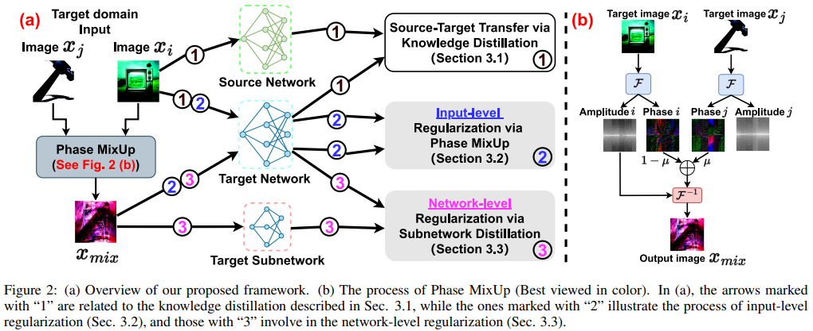
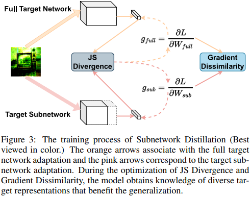
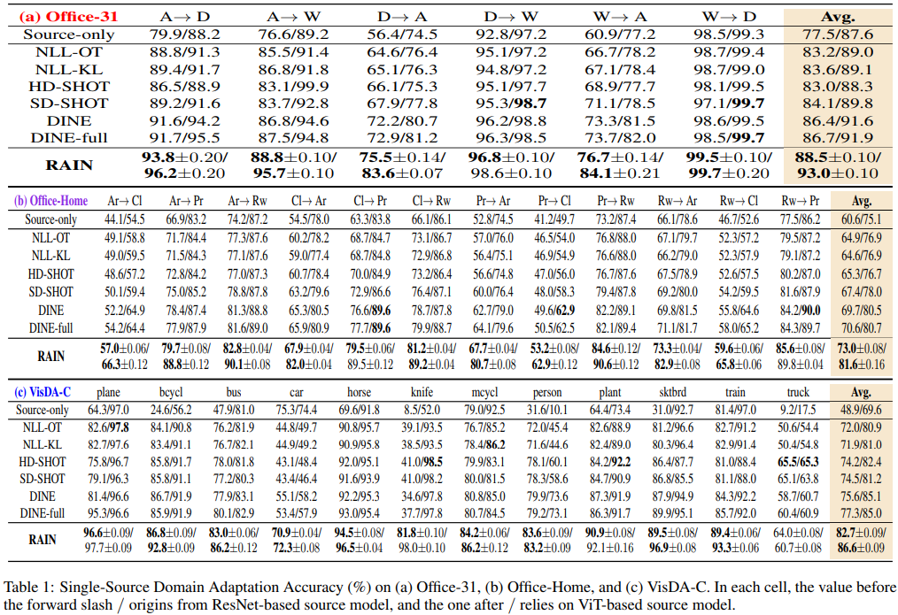
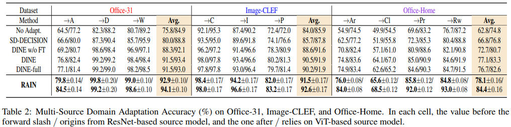

# [**[IJCAI-2023] RAIN: RegulArization on Input and Network for Black-Box Domain Adaptation**](https://arxiv.org/abs/2208.10531)


### Prerequisites:
- python == 3.6.8
- pytorch ==1.1.0
- torchvision == 0.3.0
- numpy, scipy, sklearn, PIL, argparse, tqdm


### Training:
Execute train_rain.py.

### Method:  




### Results:  




### Citation

If you find this code useful for your research, please cite our paper

```
@inproceedings{Peng2022RAINRO,
  title={RAIN: RegulArization on Input and Network for Black-Box Domain Adaptation},
  author={Qucheng Peng and Zhengming Ding and L. Lyu and Lichao Sun and Chen Chen},
  booktitle={International Joint Conference on Artificial Intelligence (IJCAI)}, 
  year={2023}
}
```

	
